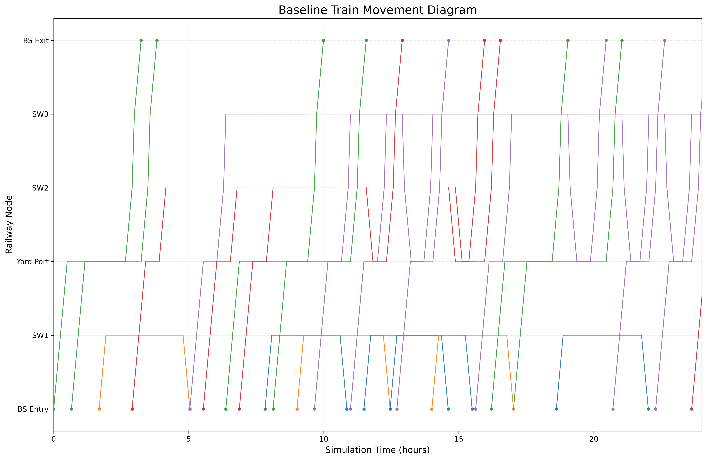

# Railway Discrete-Event Simulation

A Python-based discrete-event simulation for analyzing railway operations, train movements, infrastructure capacity, and resource utilization.

## Project Overview

This project simulates railway operations between the Branch Station (BS), Yard Port, and industrial destinations. It models train generation, train movements, corridor occupancy, station capacity, operational waiting times, and railway resource utilization.

The current version represents the baseline operational scenario and generates visual outputs for evaluating railway performance.

## Objectives

The main objectives of this project are:

* Simulate railway train arrivals and movements
* Model corridor and station capacity constraints
* Manage railway resource occupancy
* Calculate train processing performance
* Analyze resource utilization
* Generate a train movement diagram
* Evaluate daily railway operations

## Key Features

* Discrete-event railway simulation
* Train generation and movement scheduling
* Corridor occupancy management
* Station capacity constraints
* Yard Port capacity management
* Train waiting and processing logic
* Resource utilization analysis
* Train movement diagram generation
* Daily processed-train reporting
* Reproducible simulation using a fixed random seed

## Project Structure

```text
railway-discrete-event-simulation/
│
├── run.py
│
├── src/
│   ├── revised_code_time_table.py
│   └── baseline_plot.py
│
├── outputs/
│   ├── baseline_movement_diagram.png
│   ├── resource_utilization.png
│   └── trains_processed_per_day.png
│
├── README.md
├── LICENSE
└── .gitignore
```

## File Descriptions

### `run.py`

The main entry point of the project. It runs the railway simulation from the root directory.

### `src/revised_code_time_table.py`

The main simulation file. This file includes the railway operating logic, train generation, train movements, resource management, station capacities, and simulation execution.

This file must be executed before generating the movement diagram.

### `src/baseline_plot.py`

This file reads or processes the simulation results and generates the baseline train movement diagram and other operational visualizations.

### `outputs/`

This directory contains the main visual outputs produced by the project.

## Installation

### 1. Clone the Repository

```bash
git clone YOUR_REPOSITORY_URL
```

Replace `YOUR_REPOSITORY_URL` with the URL of this GitHub repository.

For example:

```bash
git clone https://github.com/YOUR_USERNAME/railway-discrete-event-simulation.git
```

### 2. Enter the Project Directory

```bash
cd railway-discrete-event-simulation
```

### 3. Create a Virtual Environment

Creating a virtual environment is recommended but optional.

On Windows:

```bash
python -m venv venv
```

Activate it using:

```bash
venv\Scripts\activate
```

On Linux or macOS:

```bash
python3 -m venv venv
source venv/bin/activate
```

### 4. Install the Required Packages

```bash
pip install -r requirements.txt
```

## Running the Project

The simulation must be executed before running the visualization file.

### Step 1: Run the Simulation

From the main project directory, run:

```bash
python run.py
```

This command executes:

```text
src/revised_code_time_table.py
```

You can also run the simulation file directly:

```bash
python src/revised_code_time_table.py
```

### Step 2: Generate the Movement Diagram

After the simulation has completed successfully, run:

```bash
python src/baseline_plot.py
```

The correct execution order is therefore:

```bash
python run.py
python src/baseline_plot.py
```

## Outputs

### Baseline Train Movement Diagram

The movement diagram visualizes train movements across the main railway corridors. It can be used to identify train movements, waiting periods, corridor occupancy, and operational interactions during the simulation period.



### Resource Utilization

The resource utilization chart shows the percentage of time that important railway resources are occupied during the simulation.

This output helps identify highly utilized resources and possible operational bottlenecks.


### Trains Processed per Day

This chart presents the number of trains processed during each simulation day.

It can be used to evaluate daily throughput and changes in operational performance over the simulation horizon.


## Technologies Used

* Python
* SimPy
* NumPy
* Pandas
* Matplotlib
* Object-oriented programming
* Discrete-event simulation

## Simulation Workflow

The general simulation workflow is:

1. Initialize the simulation environment.
2. Define railway resources and their capacities.
3. Generate trains based on the simulation assumptions.
4. Assign destinations and operational processes to trains.
5. Manage access to stations and railway corridors.
6. Record train movements and waiting periods.
7. Calculate railway operational indicators.
8. Generate movement diagrams and performance charts.

## Main Performance Indicators

The project can be used to evaluate indicators such as:

* Number of generated trains
* Number of processed trains
* Trains processed per day
* Train waiting time
* Train movement time
* Corridor occupancy
* Station capacity usage
* Railway resource utilization
* Operational delays
* Overall railway throughput

## Current Limitations

The current project represents the baseline railway operating scenario.

Some parts of the code are currently contained in large Python files and can be further modularized. The current version also focuses mainly on simulation execution and output visualization.

The following limitations may be addressed in future versions:

* Limited automated testing
* Large simulation source files
* Limited scenario comparison
* Limited configuration through external files
* No graphical user interface
* Limited sensitivity analysis
* No automatic optimization of railway operations

## Future Improvements

Future development may include:

* Dividing the simulation code into smaller modules
* Adding automated unit tests
* Adding multiple infrastructure scenarios
* Comparing baseline and improved scenarios
* Adding YAML or JSON configuration files
* Adding sensitivity analysis
* Adding simulation replications
* Calculating confidence intervals
* Adding additional operational KPIs
* Improving event-driven resource management
* Adding an interactive dashboard
* Adding optimization methods for train scheduling

## Author

**Ali Behroozi**

Transportation Engineer and Data Science Researcher with interests in:

* Railway simulation
* Transportation data science
* Discrete-event simulation
* Mobility analytics
* Machine learning
* Graph neural networks
* Sustainable transportation systems

## License

This project is available under the MIT License. See the `LICENSE` file for more information.

https://github.com/alibehroozi43/railway-discrete-event-simulation.git
